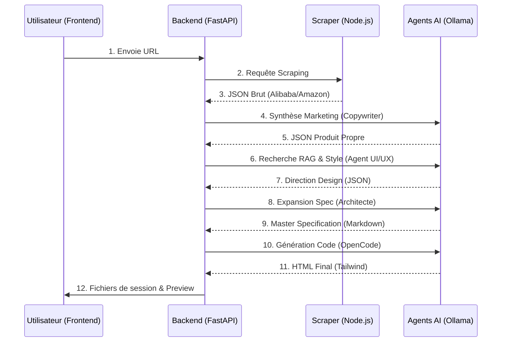

# Workflow Technique : De l'URL à la Page Finale

Ce document détaille l'ordre d'exécution du système Raw Logic AI, les invites (prompts) utilisées à chaque étape et l'explication technique du biais "Brutaliste".

## 1. Schéma de Flux (Orchestration)

---

## 2. Détail des Étapes & Prompts

### Étape 1 : Scraping (Service Headless)

- **Entrée** : URL du produit.
- **Sortie** : Fichier `product_data.json` (Données brutes : prix, description usine, specs techniques).

### Étape 2 : Synthèse Marketing (`copywriter.py`)

- **Rôle** : Nettoyer le charabia des fiches produits Alibaba.
- **Prompt d'entrée** : _"Tu es un Copywriter Expert... transforme les données brutes en une synthèse marketing captivante... Retourne un JSON [title, synthesis, features]."_
- **Sortie** : Fichier `product_synthesis.json` (Un titre sexy, un texte de vente et 5 points clés).

### Étape 3 : Analyse & RAG (`analyzer.py` + `rag_agent.py`)

- **Rôle** : Décider du look de la page.
- **Entrée** : Le titre du produit issu de la synthèse.
- **Sortie** : Une direction design (Couleurs, Typo, Effets).

### Étape 4 : Master Specification (`architect.py`)

- **Rôle** : Créer le cahier des charges technique pour le codeur.
- **Prompt d'entrée** : _"Tu es un Directeur de Création... transformes la direction design en Master Specifications ultra-détaillées... Utilise CSS exact, Tailwind tokens..."_
- **Sortie** : Fichier `style_spec.md`.

### Étape 5 : Coding (`coder.py`)

- **Rôle** : Assembler le design et le contenu dans un fichier HTML.
- **Prompt d'entrée** : _"Génère une page HTML unique... Utilise Tailwind via CDN... Respecte scrupuleusement la spec... Ne jamais bloquer les clics (`pointer-events: none`)."_
- **Sortie** : Fichier `final_page.html`.

---

## 3. L'Énigme du Brutalisme 🕵️‍♂️

Tu as remarqué que le système génère presque toujours un style **Brutaliste** (grosses bordures noires, coins carrés, look "brut"). Voici pourquoi techniquement :

### Le Faux Positif dans l'Analyseur

Dans le fichier `ui-agent/ui-rag/analyzer.py`, le système cherche des mots-clés pour deviner le style.

- **Ligne 29** : `"brutalism": ["brutal", "raw", "brut", "fort", "bold"]`
- **Le problème** : Pour des chaussures Puma, la synthèse marketing dira souvent que la chaussure est **"fortement"** amortie ou que c'est un choix **"fort"**.
- **Erreur de logique** : L'analyseur voit le mot **"fort"**, l'associe immédiatement au **"Brutalisme"**, et l'Injecte dans le RAG.

### Le Cercle Vicieux (Agentic Loop)

Une fois que l'Analyseur a dit "C'est du brutalisme", l'Agent RAG cherche des guidelines de brutalisme, l'Architecte écrit une spec de brutalisme, et le Codeur exécute fidèlement.

### Correction prévue

- **Suppression** des mots-clés génériques (`fort`, `bold`) de l'analyseur pour qu'ils ne déclenchent plus le brutalisme par erreur.
- **Priorité au Minimalisme** par défaut pour un look plus "SaaS moderne" et haut de gamme.
